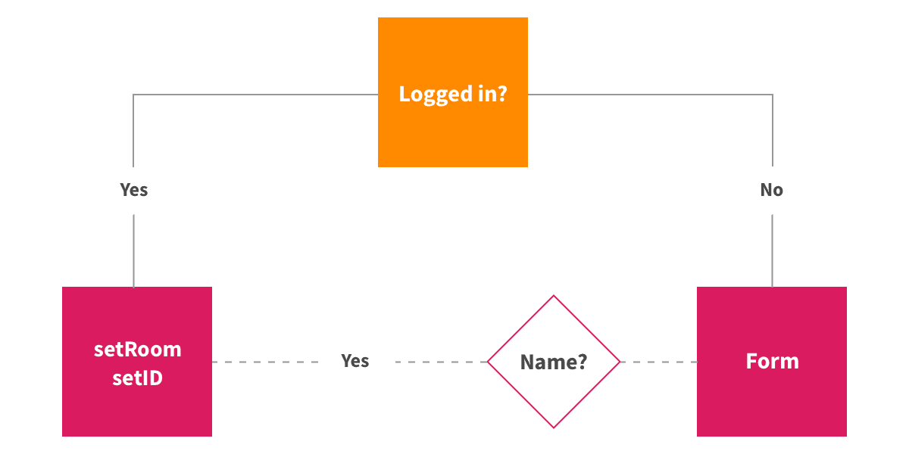

> 原文链接：[Build a Chat App Using React Hooks in 100 Lines of Code](https://css-tricks.com/build-a-chat-app-using-react-hooks-in-100-lines-of-code/)

我们之前在 CSS-Tricks 就已经了解过 [React Hooks](https://css-tricks.com/intro-to-react-hooks/)。我有 [一篇文章](https://blog.flexiple.com/react-hooks-learn-by-building-a-notes-app/) 介绍它们，来说明如何使用它们通过函数来创建组件。这两篇文章都大概地介绍了它们的运作方式，但也开辟了很多可能性。

所以这是我们在本文中将要做的。我们将通过构建一个聊天应用程序来了解 hooks 是如何使我们的开发过程变得更加容易和快捷。

具体来讲，我们使用 [Create React App](https://github.com/facebook/create-react-app) 来构建这个聊天应用。然后我们将使用一些 React Hooks 来简化开发过程以及删除很多不必要的样板代码。

我们也将会使用几个开源的 React Hooks。这些 hooks 能够直接用来编写功能，否则这些功能将需要更多的代码来创建。这些方法也通常遵循公认的标准。事实上，这也提高了编写代码的效率和提供了安全的功能。

### 让我们来看看需求

我们要构建的聊天应用程序将会有以下功能：

- 从服务端获取历史消息列表
- 连接到一个房间来进行群组聊天
- 当成员与房间进行连接或断开连接时进行更新
- 发送和接收消息

[https://css-tricks.com/wp-content/uploads/2019/07/chat-movie.m4v](https://css-tricks.com/wp-content/uploads/2019/07/chat-movie.m4v)

在我们深入研究 React 代码时，需要有以下几个前提：

- 我们使用这个 [项目](https://github.com/akash-joshi/socket-server) 当作黑盒服务端。并不需要担心它的性能，我们只是使用简单的 Socket 与它进行通信。
- 所有的样式将会包含在一个 CSS 文件中，它可以被复制到 src 目录中。所有在应用中用到的样式都会存放在这个 [仓库](https://github.com/akash-joshi/socket-blog-client/blob/master/src/index.css) 中。

### 准备工作

好的，我们希望我们的开发环境已经被准备好可以编写代码了。首先，React 需要 Node 和 npm，你可以在 [这里](https://nodejs.org/) 了解到如何安装它们。

让我们从终端启动一个新项目：

    npx create-react-app socket-client
    cd socket-client
    npm start

现在我们的浏览器会被跳转到 `http://localhost:3000` ，然后看到一个默认的项目欢迎页面。

从现在开始，我们将会使用 hooks 来分解工作。这将会在实际使用过程中帮助我们理解这些 hooks。

### 使用 useState

我们第一个使用的 hook 是 `[useState](https://reactjs.org/docs/hooks-state.html)` 。它允许我们在组件中维护状态，而不必使用 `this.state` 来编写和初始化类。 

数据作为常量（例如用户名），被保存在 `useState` 变量中。这可以保证数据可以很容易地获取，同时需要编写的代码也会少得多。

`useState` 的主要优点是，只要我们更新应用的状态，它就会自动地反映在已被渲染地组件上。如果我们常规地使用变量，它们将不会被视作组件地状态，并且必须通过 props 传递来重新渲染这个组件。所以，我们再次削减了大量的工作并且简化了流程。

`useState` 内置在 React 中，所以可以通过一行代码来引入它：

    import React, { useState } from 'react';

我们将创建一个简单的组件，如果用户已经登陆，它将会返回 "Hello"，反之如果用户已经注销，则返回登陆表单，我们通过检查变量 `id` 来进行判断。

表单提交将会由 `handleSubmit` 函数来进行处理。它会检查 Name 字段是否填写。如果是，我们讲为该用户设置 `id` 和 `room` 值。否则，我们将抛出一条消息来告诉用户需要提供 Name 字段。

    // App.js
    
    import React, { useState } from 'react';
    import './index.css';
    
    export default () => {
      const [id, setId] = useState("");
      const [nameInput, setNameInput] = useState("");
      const [room, setRoom] = useState("");
    
      const handleSubmit = e => {
        e.preventDefault();
        if (!nameInput) {
          return alert("Name can't be empty");
        }
        setId(nameInput);
        socket.emit("join", nameInput, room);
      };
    
      return id !== '' ? (
        
Hello

      ) : (
        

          <form onSubmit={event => handleSubmit(event)}>
            <input
              id="name"
              onChange={e => setNameInput(e.target.value.trim())}
              required
              placeholder="What is your name .."
            />
             
            <input
              id="room"
              onChange={e => setRoom(e.target.value.trim())}
              placeholder="What is your room .."
            />
             
            <button type="submit">Submit</button>
          </form>
        

      );
    };

这就是我们在聊天应用中使用 `useState` 的方式。同样我们从 React 中导入 hook，用其来初始化用户 id 和聊天室位置，如果用户已登录，则设置这些值，如果用户已注销，则返回登陆表单。

### 使用 useSocket

我们将会使用一个叫做 [useSocket](https://github.com/iamgyz/use-socket.io-client) 的一个开源的 hook 来连接我们的服务器。不同于 `useState`，它并不内置于 React，所以在使用之前，我们需要将它添加到我们的项目中。

    npm add use-socket.io-client

与服务端的连接是通过使用 React Hooks 版本的 socket.io 库，这是一种更简单的方式来保持与服务端的 websocket 连接。我们用它来发送和接收实时消息，比如连接到一个房间。

默认的 [socket.io](http://socket.io) 客户端库具有一个全局变量，即我们定义的这个 socket 变量可以被所有组件使用。因此，我们的数据能够在任何我们不知道的地方进行操作，从而发生变化。Socket hook 通过在组件级别的定义来解决这个问题，这意味着每个组件都只负责自己的数据传输。

`useSocket` 的基本用法如下所示：

    const [socket] = useSocket('socket-url')

我们将会使用一些 socket API。为了便于参考，所有使用到的 API 都已经在 [socket.io官方文档](https://socket.io/docs) 中被列出。但是现在，让我们导入之前已经安装好的 hook。

    import useSocket from 'use-socket.io-client';

接下来，我们需要初始化这个钩子来与我们的服务端进行连接。然后我们将在控制台中记录 socket 来检查它是否正常连接。

    const [id, setId] = useState('');
    const [socket] = useSocket('https://open-chat-naostsaecf.now.sh');
    
    socket.connect();
    console.log(socket);

此时打开浏览器控制台，代码片段中的 URL 应已被记录下来。

### 使用 useImmer

我们的聊天程序将使用 [useImmer](https://github.com/immerjs/use-immer)  来管理数组和对象的状态，而避免去改变它们的原始状态。它结合了 `useState` 和 [Immer](https://github.com/mweststrate/immer) 来提供不可变的状态管理机制。这对于管理在线人员列表和需要显示的消息来说非常方便。

在 useState 中使用 Immer 允许我们通过从当前状态创建新状态来更改数组和对象。这使得只要当前状态保持不变，通过不同的条件去操作数据将会变得更加安全。

同样，它并没有内置与 React 中，所以我们需要将它导入到项目中：

    npm add use-immer

它的基本用法非常简单。构造函数返回的数组中第一个值是当前状态，第二个值是更新该状态的函数。而传入 `useImmer` 函数的参数将作为当前状态的初始值。

    const [data, setData] = useImmer(default_value)

### 使用 setData

注意到上个例子中的 `setData` 函数了吗？我们将用它来创建当前数据的草稿副本，并且可以使用它来安全地操作数据，并用作下一个状态时，将其变为不可变数据。

因此，我们的原始数据将会被保留，直到我们运行完该函数并且清楚无误地更新完新数据。

    setData(draftState => { 
      draftState.operation(); 
    });
    
    // ...or
    
    setData(draft => newState);
    
    // Here, draftState is a copy of the current data

### 使用 useEffect

好了，我们回到一个内置于 React 的钩子。我们将使用 useEffect 来执行一段只在应用程序载入时运行的代码。这能确保我们的代码只允许一次，而不是每当组件重新渲染时都运行一次，这对性能有好处。

我们需要做的仅仅是直接引入它，而不需要安装。

    import React, { useState, useEffect } from 'react';

我们需要一个组件来更加数组中的 **sender ID** 是否存在来渲染一条**消息**或者是**更新提示**，作为有创造力的人，我们将它叫做 `Messages` 组件。

    const Messages = props => props.data.map(m => m[0] !== '' ? 
    (<li key={m[0]}><strong>{m[0]}</strong> : 
{m[1]}
</li>) 
    : (<li key={m[1]} className="update">{m[1]}</li>) );

让我们将 socket 逻辑放入 `useEffect` 中，这样当组件重新渲染时，我们就不会重新复制同一套消息集。

我们将在组件中定义消息 hook，用它与 socket 进行连接，然后再 `useEffect` 中为新消息和更新设置监听器。我们还将在监听器中设置更新函数。

    const [socket] = useSocket('https://open-chat-naostsaecf.now.sh');      
    socket.connect();
    
    const [messages, setMessages] = useImmer([]);
    useEffect(()=>{
      socket.on('update', message => setMessages(draft => {
        draft.push(['', message]);
      }));
    
      socket.on('message que',(nick, message) => {
        setMessages(draft => {
          draft.push([nick, message])
        })
      });
    },0);

另外，如果用户名和房间名填写正确，我们还会增加一条 "join" 消息。这将触发其余的事件监听器，我们可以在该房间中接收到过去房间里发送的消息以及任何需要的更新。

    // ...
      socket.emit('join', name, room);
    };
    
    return id ? (
      <section style={{ display: "flex", flexDirection: "row" }}>
          <ul id="messages">
            <Messages data={messages} />
          </ul>
          <ul id="online">
            {" "}
            &#x1f310; : <Online data={online} />{" "}
          </ul>
          

            <form onSubmit={e => handleSend(e)} style={{ display: "flex" }}>
              <input id="m" onChange={e => setInput(e.target.value.trim())} />
              <button style={{ width: "75px" }} type="submit">
                Send
              </button>
            </form>
          

        </section>
    ) : (
    // ...

### 最后的调整

我们只有几个调整来完成我们的聊天应用程序开发，具体来说，我们仍需要：

- 一个显示在线用户的组件
- 一个带 socket 监听器的 `useImmer` hook
- 一个合适的 socket 消息处理方法

所有的这些都是基于我们之前已经讨论过的内容，我将再 `App.js` 这个文件中放入项目的完整代码，来显示这些内容是如何组合在一起的。

    // App.js
    
    import React, { useState, useEffect } from 'react';
    import useSocket from 'use-socket.io-client';
    import { useImmer } from 'use-immer';
    
    import './index.css';
    
    const Messages = props => props.data.map(m => m[0] !== '' ? (<li><strong>{m[0]}</strong> : 
{m[1]}
</li>) : (<li className="update">{m[1]}</li>));
    
    const Online = props => props.data.map(m => <li id={m[0]}>{m[1]}</li>);
    
    export default () => {
      const [id, setId] = useState('');
      const [nameInput, setNameInput] = useState('');
      const [room, setRoom] = useState('');
      const [input, setInput] = useState('');
    
      const [socket] = useSocket('https://open-chat-naostsaecf.now.sh');
      socket.connect();
    
      const [messages, setMessages] = useImmer([]);
      const [online, setOnline] = useImmer([]);
    
      useEffect(() => {
        socket.on('message que', (nick, message) => {
          setMessages(draft => {
            draft.push([nick, message])
          })
        });
    
        socket.on('update', message => setMessages(draft => {
          draft.push(['', message]);
        }));
    
        socket.on('people-list', people => {
          let newState = [];
          for (let person in people) {
            newState.push([people[person].id, people[person].nick]);
          }
          setOnline(draft => { draft.push(...newState) });
          console.log(online)
        });
    
        socket.on('add-person', (nick, id) => {
          setOnline(draft => {
            draft.push([id, nick])
          })
        });
    
        socket.on('remove-person', id => {
          setOnline(draft => draft.filter(m => m[0] !== id))
        });
    
        socket.on('chat message', (nick, message) => {
          setMessages(draft => { draft.push([nick, message]) })
        });
      }, 0);
    
      const handleSubmit = e => {
        e.preventDefault();
        if (!nameInput) {
          return alert("Name can't be empty");
        }
        setId(name);
        socket.emit("join", name, room);
      };
    
      const handleSend = e => {
        e.preventDefault();
        if (input !== '') {
          socket.emit('chat message', input, room);
          setInput('');
        }
      };
    
      return id ? (
        <section style={{ display: 'flex', flexDirection: 'row' }} >
          <ul id="messages"><Messages data={messages} /></ul>
          <ul id="online"> &#x1f310; : <Online data={online} /> </ul>
          

            <form onSubmit={e => handleSend(e)} style={{ display: 'flex' }}>
              <input id="m" onChange={e => setInput(e.target.value.trim())} /><button style={{ width: '75px' }} type="submit">Send</button>
            </form>
          

        </section>
      ) : (
          

            <form onSubmit={event => handleSubmit(event)}>
              <input id="name" onChange={e => setNameInput(e.target.value.trim())} required placeholder="What is your name .." /> 
              <input id="room" onChange={e => setRoom(e.target.value.trim())} placeholder="What is your room .." /> 
              <button type="submit">Submit</button>
            </form>
          

        );
    };

### 结语

就是这样！我们一起构建了一个功能齐全的群组聊天应用！这应该非常酷吧？项目的完整代码可以在[GitHub](https://github.com/akash-joshi/fcc-socket-client) 上找到。

我们在本文中讨论的仅仅是如何通过 React Hooks 来提高你的生产力，以及如何使用强大的前端工具帮助你构建功能强大的应用程序。[在该教程中](https://blog.flexiple.com/build-a-powerful-chat-application-using-react-hooks/)，我构建了一个更健壮的聊天应用程序。如果你想使用 React Hooks 进一步升级，请参考该教程中的步骤。

现在你已经有了使用 React Hooks 的实际经验，使用你新获得的只是来获得更多的实践！这里有一些想法你可以实现：

- 一个博客平台
- 属于你自己的 Instagram
- 克隆一个 Reddit

有问题吗？留下你的评论，让我们一起做一些很棒的事情吧！