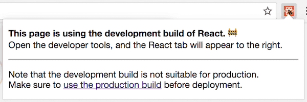

如果您的 JavaScript 代码库已经相当复杂，**那么你可能有一种方法可以在开发和生产环境中打包并运行不同的代码**。

在开发和生产环境中打包和运行不同的代码是非常强大的。在开发模式下，React 会包含很多警告来帮助你在程序导致 bug 之前找到问题。然而检测这些错误所需的代码通常会增加包体积的大小，就会因此导致应用程序运行起来变得缓慢。

这种运行缓慢的代价在开发环境下是可以被接受的。事实上，在开发中减慢代码的运行速度*甚至可能是有益的*，因为它在一定程度上弥补了开发人员（高性能的）机器与普通消费者设备之间的差异。

可是在生产环境中，我们不想支付任何额外的成本。因此，我们在生产环境中删除了这些检查错误的代码。这是怎么做到的呢？让我们来看一下。

------

在开发环境中运行不同代码的确切方式取决你的 JavaScript 构建流程（以及是否有）。在 Facebook 中是这样做的：

 ```javascript
if (__DEV__) {
  doSomethingDev();
} else {
  doSomethingProd();
}
 ```

在这里，`__DEV__` 并不是一个真正的变量。在模块组合在一起以供浏览器使用的时候，它是一个常量。结果看起来像是这个样子：

```javascript
// 开发环境中:
if (true) {
  doSomethingDev(); // 👈
} else {
  doSomethingProd();
}

// 生产环境中:
if (false) {
  doSomethingDev();
} else {
  doSomethingProd(); // 👈
}
```

在生产环境下，你还要给代码进行压缩（例如使用 [terser](https://github.com/terser-js/terser)）。大部分 JavaScript 的代码压缩器会执行对有限形式的[无效代码清除](https://en.wikipedia.org/wiki/Dead_code_elimination)，例如剔除 `if (false)` 分支。所以在生产环境中你只会看见：

```javascript
// 生产环境中 (代码压缩后):
doSomethingProd();
```

（请注意，主流的 JavaScript 代码压缩工具在消除死代码方面有很大的限制，但这是另外的一个话题了。）

虽然你可能没有使用 `__DEV__` 这种魔术常量，但如果你使用一个流行的 JavaScript 打包工具（例如 webpack），则可能需要遵循一些其它约定。例如，通常会用如下的代码表达和之前相同的模式：

```javascript
if (process.env.NODE_ENV !== 'production') {
  doSomethingDev();
} else {
  doSomethingProd();
}
```

当你使用一个打包工具从 npm 导入 [React](https://reactjs.org/docs/optimizing-performance.html#use-the-production-build) 和 [Vue](https://vuejs.org/v2/guide/deployment.html#Turn-on-Production-Mode) 之类的库时，正是使用这种模式。（单文件 `<script>` 标记导入的环境下，开发环境和生产环境分别提供了 `.js` 和  `.min.js` 文件 。）

这种特定的约定最初来自于 Node.js。在 Node.js 中，全局变量叫做 `process`，它将你系统的环境变量作为 `process.env` 对象的属性暴露出来。但是，点那个你在前端代码库中看到这个模式时，通常不会涉及到任何真正的 `process` 变量。🤯

相反，整个 `process.env.NODE_ENV` 表达式在构建的时候就被字符串文字替换，就像我们的魔术变量 `__DEV__` 那样：

```javascript
// 开发环境中:
if ('development' !== 'production') { // true
  doSomethingDev(); // 👈
} else {
  doSomethingProd();
}

// 生产环境中:
if ('production' !== 'production') { // false
  doSomethingDev();
} else {
  doSomethingProd(); // 👈
}
```

因为整个表达式是一个常量（`'production' !== 'production'` 的结果保证是 `false`），代码压缩工具也因此会剔除另外的分支。

```javascript
// 生产环境中 (代码压缩后):
doSomethingProd();
```

恶作剧完成（*Mischief Managed*）。

------

请注意这**并不适用于**更复杂的表达式：

```javascript
let mode = 'production';
if (mode !== 'production') {
  // 🔴 并不能保证被清除
}
```

由于 JavaScript 的动态特性导致静态分析工具并不是十分聪明。当看到 `mode` 这样的变量而不是像 `false` 或 `'production' !== 'production'` 这样的静态表达式，它们通常会放弃操作。

同样，当你使用顶级 `import` 语句时，JavaScript 中的无效代码清除无法在模块边界上很好地发挥作用。

```javascript
// 🔴 同样不能保证被清除
import {someFunc} from 'some-module';

if (false) {
  someFunc();
}
```

因此你需要以非常机械的方式编写代码，以确保条件*绝对静态*，并确保要消除的代码都在代码块中。

------

为了让这些代码正常工作，打包工具需要对 `process.env.NODE_ENV` 进行替换，并且需要知道要以哪种模式构建项目。

几年前，忘记配置环境曾经很普遍。你经常会看到以开发模式部署到生产环境中的项目。

在过去的两年中，这种情况得到了很大的改善。例如，webpack 添加了一个简单的模式选项，而不是手动配置对 `process.env.NODE_ENV` 的替换。现在，React DevTools 还在具有开发模式的站点上显示红色图标，使得更容易被发现并且进行[上报](https://mobile.twitter.com/BestBuySupport/status/1027195363713736704)。



诸如 Create React App，Next/Nuxt，Vue CLI，Gatsby 和一些其它的工具将开发版本和生产版本分成了两个单独的命令进行编译，让构建的版本变得不那么混乱。（例如 `npm start` 和 `npm run build`。）通常只有生产环境的版本可以被部署，因此开发人员不会再犯这种错误了。

总是有这么一个论点，就是*生产*模式需要作为默认的模式，而开发模式则需要选择性地加入。就我个人而已，我认为这种观点没有什么说服力。从开发模式的警告中受益最大的人通常是使用该库的新手。*他们通常不知道怎么将开发模式开启*，并且因此会遗漏很多因警告提示而被发现的 bug。

是的，因开启开发模式而导致的性能问题会很糟糕。但向最终用户提供有缺陷的体验亦是如此。例如，[React 对于 key 的警告](https://reactjs.org/docs/lists-and-keys.html#keys)有助于避免向错误的人发送消息或购买错误的产品这些问题。在警用这个警告的情况下进行开发对你*和*你的用户而言都会有重大的风险。如果默认情况下处于关闭状态，那么当你找到并打开这个开关的时候，你将会收到很多警告需要处理。因此，大多数人会将其再次关闭。这就是为什么它需要从一开始就被启用，而不是在以后启用的原因。

最后，即使开发环境下的警告是可选的，并且开发人员在开发的早期就知道并且打开它们，我们还是要回到原来的问题上。在部署到生产环境的时候，有人还是会不小心把它们留着！

我们又回到了起点。

就我个人而言，我相信**工具显示和使用正确的模式取决于你是在调试还是在进行部署**。数十年来，除 Web 浏览器之外，几乎所有其他环境（无论是移动设备，台式机或是服务器）都可以加载和区分开发版本和生产版本。

也许是时候让 JavaScript 环境将这种区别视作头等需求了，而不是让库提出并依赖这种临时的约定。

------

哲学已经说的够多了！

让我们再看一下这段代码：

```javascript
if (process.env.NODE_ENV !== 'production') {
  doSomethingDev();
} else {
  doSomethingProd();
}
```

你可能想知道：如果前端代码中没有真正的 `process` 对象，那么为什么 React 和 Vue 之类的库在 npm 的构建中依赖它。

（再次说明一下：你可以在浏览器中加载 React 和 Vue 提供的 `<script>` 标签代码，这并不需要依赖它。相反你必须手动选择基于开发环境的 `.js` 文件和基于生产环境的 `.min.js` 文件。以下章节仅关于从 npm 导入 React 或 Vue 并且通过打包工具进行使用。 ）

与编程中的许多东西一样，这种特殊的约定主要是出于历史原因。我们仍在使用它，因为它现在被不同的工具广泛采用。转换到其它方式的代价是很大的，并且受益也不高。

那么背后的历史原因是什么呢？

在 `import` 和 `export` 语法标准化之前的很多年，存在几种互相竞争的方式来表达模块之间的关系。Node.js 普及了 `require()` 和 `module.exports`，它被称之为 [CommonJS](https://en.wikipedia.org/wiki/CommonJS)。

早先在 npm 仓库发布的代码只为 Node.js 编写的。[Express](https://expressjs.com/) 曾是（可能仍然是？）最受欢迎的 Node.js 服务器端框架，它[使用 NODE_ENV 环境变量](https://expressjs.com/en/advanced/best-practice-performance.html#set-node_env-to-production)来启用生产模式。一些其它的 npm 包也采用了相同的约定。

早期的 JavaScript 打包工具（例如 browserify）希望在前端项目中使用 npm 的代码成为可能。（是的，[那时候](https://blog.npmjs.org/post/101775448305/npm-and-front-end-packaging)没有人在前端项目中使用 npm 的包！你能想象吗？）因此，他们将 Node.js 生态中已经存在的约定扩展到了前端代码中。

最初的 “envify” 转换工具[发布于2013年](https://github.com/hughsk/envify/commit/ae8aa26b759cd2115eccbed96f70e7bbdceded97)。React 也是那时候开源的，而带有 browserify 的 npm 似乎是那个时代打包前端 CommonJS 代码的最佳解决方案。

React 从一开始就提供 npm 构建版本（除了 `<script>` 标签构建）。随着 React 的流行，使用 CommonJS 模块编写模块化的代码并通过 npm 发布前端代码的做法成为了一种实践。

React 需要在生产模式下删除开发模式的代码。Browserify 已经提供了针对该问题的解决方案，因此 React 也为其 npm 的构建使用了 `process.env.NODE_ENV` 这种约定。随着时间的流逝，许多其他工具和库（包括 webpack 和 Vue），都采用了相同的做法。

到了 2019 年，browserify 失去了相当多的市场份额。但是，在构建步骤期间将 `process.env.NODE_ENV` 替换成 `development` 或者 `production` 是一种和以往一样流行的约定。

------

可能仍然让你感到困惑的一件事是，在 Github 上的 React 源代码中，你会看到 `__DEV__` 仍被用作魔术变量。但是在 npm 上，它使用 `process.env.NODE_ENV`。这是什么原理呢？

过去，我们在源代码中使用 `__DEV__` 来匹配 Facebook 的源代码。长期以来，React 被直接复制到 Facebook 代码库中，因此它需要遵循相同的规则。而对于 npm，我们有一个构建步骤，就是在发布之前立刻将 `__DEV__` 替换为  `process.env.NODE_ENV !== 'production'`。

有时这是一个问题。在某些时候，依靠某种 Node.js 约定的代码模式在 npm 上效果很好，但破坏了 Facebook 代码库中的，反之亦然。

从 React 16 开始，我们已经改变了方法。相反，我们现在为每种环境（包括 `<script>`  标签，npm 和 Facebook 内部代码库）都[编译一个包](https://reactjs.org/blog/2017/12/15/improving-the-repository-infrastructure.html#compiling-flat-bundles)。所以即使是 npm 的 CommonJS 代码也可以提前编译为单独的开发包和生产包。

这意味着尽管 React 源代码中说明了 `if (__DEV__)`，但是我们实际上为每个包编译了*两个*文件。一个已经使用 `__DEV__ = true` 进行预编译，而另一个使用 `__DEV__ = false` 进行了预编译。npm 上的每个包的入口点“决定了”导出的文件。

[举个例子：](https://unpkg.com/browse/react@16.8.6/index.js)

```javascript
if (process.env.NODE_ENV === 'production') {
  module.exports = require('./cjs/react.production.min.js');
} else {
  module.exports = require('./cjs/react.development.js');
}
```

这是你的打包工具把 `'development'` 或者 `'production'` 替换为字符串的唯一地方。也是你的压缩工具除去只应在开发环境中 `require` 代码的唯一地方。

`react.production.min.js` 和 `react.development.js` 不再有任何 `process.env.NODE_ENV` 检查了。这很有意义，因为**当代码真正运行在 Node.js 中的时候**， 访问 `process.env` [有可能会很慢](https://reactjs.org/blog/2017/09/26/react-v16.0.html#better-server-side-rendering)。提前编译两个模式下的代码包也可以帮助我们优化文件的大小变得[更加一致](https://reactjs.org/blog/2017/09/26/react-v16.0.html#reduced-file-size)，无论你使用的是哪个打包压缩工具。

这就是它的工作原理！

------

我希望有一个更好的方法而不是依赖约定，但是我们已经到这了。如果在所有的 JavaScript 环境中，模式是一个非常重要的概念，并且如果有什么方法能够在浏览器层面来展示这些本不该出现的运行在开发环境下的代码，那就非常棒了。

另一方面，在单个项目中的约定可以传播到整个生态系统，这点非常神奇。2010年 `EXPRESS_ENV` [变成了 `NODE_ENV`](https://github.com/expressjs/express/commit/03b56d8140dc5c2b574d410bfeb63517a0430451) 并在 2013 年[蔓延到前端](https://github.com/hughsk/envify/commit/ae8aa26b759cd2115eccbed96f70e7bbdceded97)。可能这个解决方案并不完美，但是对每一个项目来说，接受它的成本远比说服其他每一个人去做一些改变的成本要低得多。这教会了我们宝贵的一课，关于自上而下与自下而上的方案接受。理解了相比于那些失败的标准来说它是如何一步步地转变成功的标准的。

隔离开发和线上模式是一个非常有用的技术。我建议你在你的库和应用中使用这项技术，来做一些在线上环境很重，但是在开发环境中却非常有用（通常是严格的）的校验和检查。

和任何功能强大的特性一样，有些情况下你可能也会滥用它。这是我下一篇文章的话题！